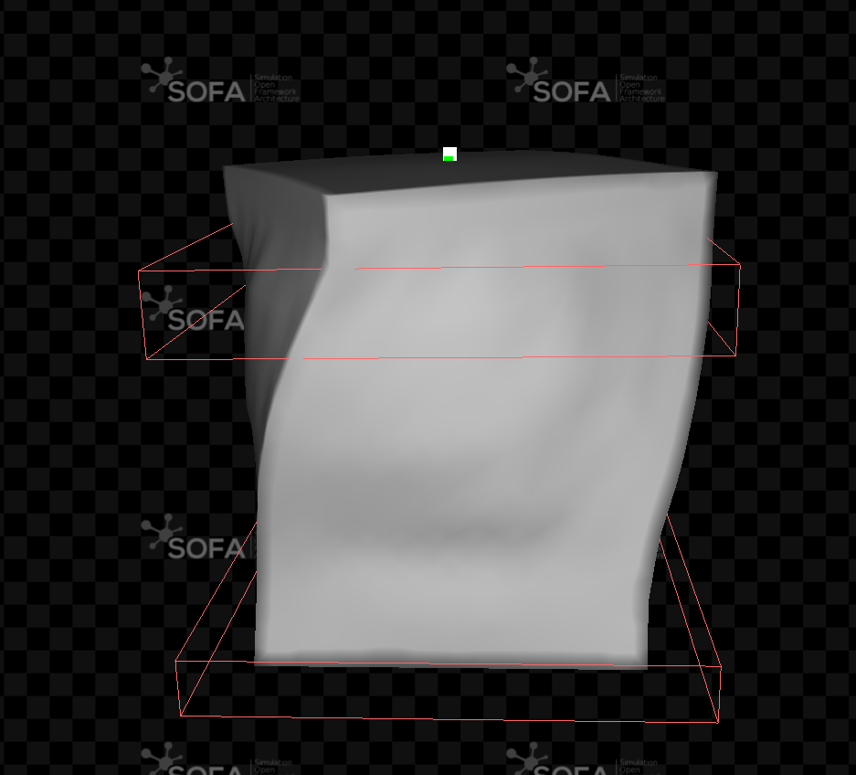

### Cubitoz

#En este repositorio se encuentra todas la scenes creadas para cada robot modular blando.

Como Ejemplo se presenta la rotacion de un módulo.

Las scenes corresponden a los modulos con deformacion Uniaxial, Biaxial, Shear, Rotador y Tilt.
